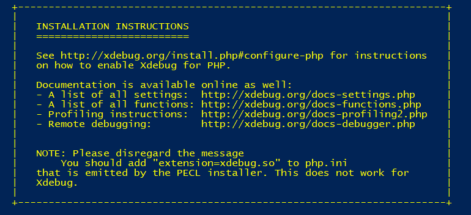
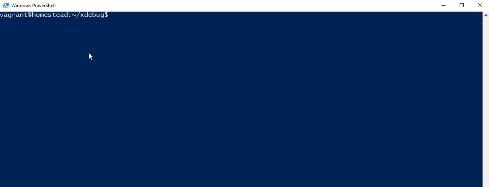

# Homestead & xdebug

Quelques lignes afin d'expliquer comment configurer Homestead (VM Vagrant pour Laravel ou autre) avec Xdebug.

1. Allez sur le lien [Homestead de Laravel](https://laravel.com/docs/5.5/homestead)

2. Suivez les instructions

    Commentaire : Je suis resté sur master
 
3. Connectez vous en ssh sur Homestead

    ````
    vagrant ssh
    ````
    
4. Installez Xdebug avec Git [ici](https://github.com/xdebug/xdebug) sur Homestead
    
    ````
    git clone https://github.com/xdebug/xdebug.git
    
    cd xdebug
    
    sudo sh rebuild.sh
    ````
    
    Résultat :
    
    
    
5. Lier Xdebug à PHP et PHP CLI
    
    5.1 Vérifier votre version PHP
    
    ````
    php -v
    ````
        
   
    
    5.2 Modifier le fichier php.ini en y ajouter la ligne ci-dessous
    
    Chemin : /etc/php/7.2/fpm/php.ini
    
    Le chemin dépend de la version
        
    ````
    zend_extension="xdebug.so"
    ````
    
    N'oubliez qu'il y a un php.ini pour le PHP pour les lignes de commandes !
    
    ````
    echo 'zend_extension="xdebug.so"' | sudo tee -a /etc/php/7.2/fpm/php.ini
    ````
    
6. Ajouter les configurations de Xdebug dans les php.ini

    ````
    xdebug.remote_enable=1
    xdebug.remote_autostart=1
    xdebug.remote_log="/home/vagrant/xdebug.log"
    xdebug.remote_handler=dbgp
    xdebug.collect_params=1
    xdebug.remote_connect_back=0
    xdebug.remote_host=10.0.2.2
    xdebug.default_enable=1
    xdebug.remote_autostart=1
    xdebug.show_local_vars=1
    xdebug.idekey=PHPSTROM
    xdebug.profiler_enable=1
    xdebug.profiler_output_dir='/home/vagrant/profile'
    ````
    