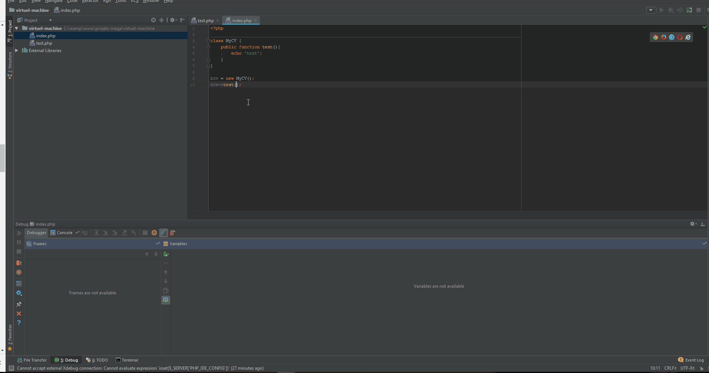
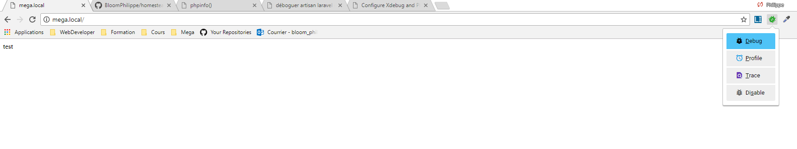

# Homestead & xdebug

Quelques lignes afin d'expliquer comment configurer Homestead (VM Vagrant pour Laravel ou autre) avec Xdebug.

1. Allez sur le lien [Homestead de Laravel](https://laravel.com/docs/5.5/homestead)

2. Suivez les instructions

    Commentaire : Je suis resté sur master
 
3. Connectez vous en ssh sur Homestead

    ````
    vagrant ssh
    ````
    
4. Installez Xdebug avec Git [ici](https://github.com/xdebug/xdebug) sur Homestead
    
    ````
    git clone https://github.com/xdebug/xdebug.git
    
    cd xdebug
    
    sudo sh rebuild.sh
    ````
    
    Résultat :
    
    
    
5. Lier Xdebug à PHP et PHP CLI
    
    5.1 Vérifier votre version PHP
    
    ````
    php -v
    ````
        
   
    
    5.2 Modifier le fichier php.ini en y ajouter la ligne ci-dessous
    
    Chemin : /etc/php/7.2/fpm/php.ini
    
    Le chemin dépend de la version
        
    ````
    zend_extension="xdebug.so"
    ````
    
    N'oubliez qu'il y a un php.ini pour le PHP pour les lignes de commandes !
    
    ````
    echo 'zend_extension="xdebug.so"' | sudo tee -a /etc/php/7.2/fpm/php.ini
    ````
    
6. Ajouter les configurations de Xdebug dans les php.ini

    ````
    xdebug.remote_enable=1
    xdebug.remote_autostart=1
    xdebug.remote_log="/home/vagrant/xdebug.log"
    xdebug.remote_handler=dbgp
    xdebug.collect_params=1
    xdebug.remote_connect_back=0
    xdebug.remote_host=10.0.2.2
    xdebug.default_enable=1
    xdebug.remote_autostart=1
    xdebug.show_local_vars=1
    xdebug.idekey=PHPSTROM
    xdebug.profiler_enable=1
    xdebug.profiler_output_dir='/home/vagrant/profile'
    ````

7. Redémarrer PHP

    ````
     sudo service php7.2-fpm restart
    ````
    
8. Vérifiez que Xdebug est bien parametré et bien lié à PHP

    Créez un fichier PHP dans le dossier du projet et effectué ajoutez-y un ``phpinfo()`` 
    
    Allez sur l'URL de votre projet afin de voir les informations PHP
    
    Ci-dessous, vous pouvez voir que Xdebug est bien lié
    
    
    
    Ci-dessous, vous pouvez vos configurations
    
    
    
    
9. Configurez votre PhpStorm

    9.1 Créer un SFTP deploiement
    
    Allez dans Tools > Deployment > Configuration...
    
    
    
    **Attention, la clé SSH doit être la même que pour vous connecter via vagrant !**
    
    Cliquez sur Mapping et liez vos dossiers local et distant
    
    
    
    9.2 Ajouter un CLI Interpreter situé sur la machine virtuel
    
    Allez dans settings > Languages & Frameworks > PHP
    
    
    
    9.3 Ajouter un server de débug PHP
    
    
    
    **Attention au mapping entre le dossier du projet local et distant !**
    
10. Configurer le navigateur

    Télécharger le helper Xdebug pour Google Chrome
    
    [Lien](https://chrome.google.com/webstore/detail/xdebug-helper/eadndfjplgieldjbigjakmdgkmoaaaoc?hl=en)
    
11. Utilisation

    11.1 Placer vos breakpoints dans PhpStorm
    
    

    11.2 Activer le debug de votre extension Google Chrome quand vous êtes sur la page à debugger
    
    
    
    11.3 Rafraigissez votre page
    
    
    
    
    
## Liens sources & liens utiles

- [Lien](https://blog.eleven-labs.com/fr/debugger-avec-xdebug/)
- [Lien](https://gist.github.com/thejettdurham/bd2a80d292bebe4a3c3bc0f34acc2d47)
- [Lien](https://blog.theodo.fr/2016/08/configure-xdebug-phpstorm-vagrant/)
- [Lien](https://code.i-harness.com/fr/q/1aa4643)
- [Lien](http://danemacmillan.com/how-to-configure-xdebug-in-phpstorm-through-vagrant/)
    
    
    
    
    
